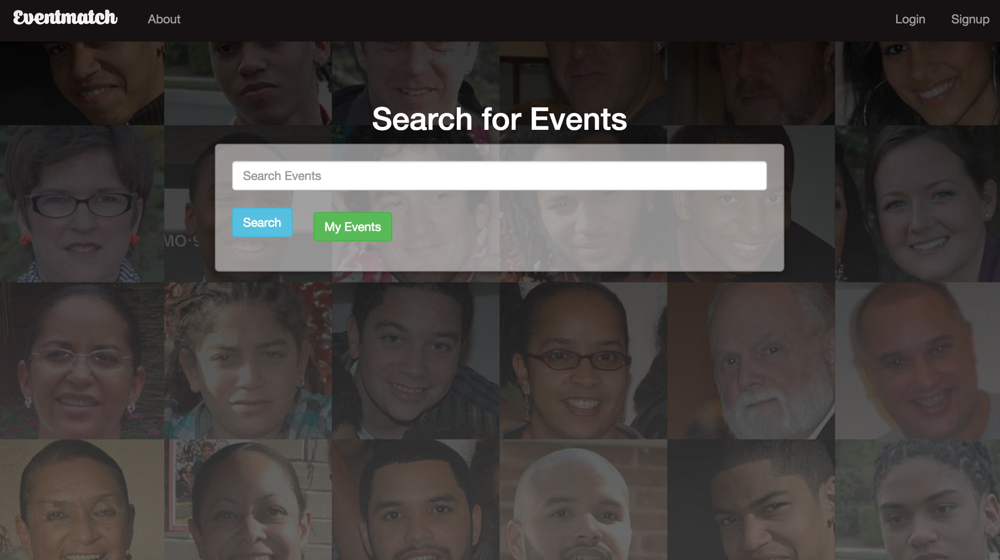

#GA-Hackathon - Eventmatch

EventMatch was a result of a 24 hour hackathon, that took place as part of the General Assembly WDI 14 course.

It is a social event app to help people find events and then be paired up with other attendees of the event.  The idea came about as sometimes, people may not feel to attend an event they are interested in, as they feel everybody else already has connections, this helps to pair up people with a shared interest, and to help them feel more comfortable attending events.

A link to the app: [Eventmatch](http://eventmatch.herokuapp.com/#/search)

###Technologies Used

The app was built using NodeJs, Passport, JWT, AngularJs, Bootstrap and Animate.css

The EventBrite API was used for the event data.

The homepage of the app:

The team found it interesting and enjoyable working on a project with a limited amount of time, and were very happy with outcome.

The app was built by 3 aspiring web developers:

* Evan Gillogley
* Dami Osinaike
* Andrea Mckenzie

